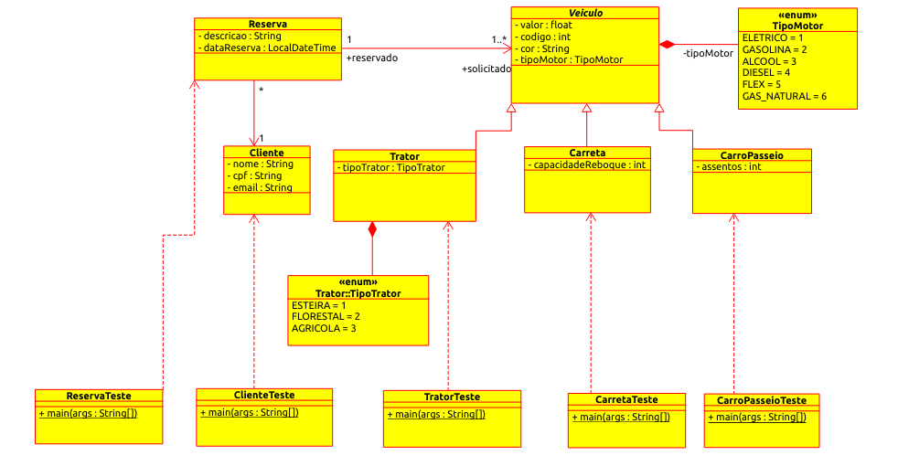

# Locadora Veículo



## Descrição

Projeto desenvolvido durante o curso de Arquitetura Java da Pós Graduação Em Arquitetura de Software ministrado por Elberth Moraes.

Aplicação possui guarda de rotas, não permitindo a navegação, exceto nas rotas publicas, antes da autenticação do usuario. Todas as senhas são criptografadas usando a biblioteca BCrypt.


## Execução

Ordem de execução da aplicação:

1. apiusuario
2. locadoraveiculosfront


Usuarios de Teste Criados na Inicialização:

```
Nome:   Administrador
Email:  admin@email.com
Senha:  123
        
Nome:   User
Email:  user@email.com
Senha:  123

```

## Execução Aplicação Monolítica e Frontend

apiusuario host: localhost:8080


## Execução API Usuario

apiusuario host: localhost:8081
path padrão: /apiusuario

Obter todos:
```
GET localhost:8081/apiusuario/usuario 
```

Obter por ID:
```
GET localhost:8081/apiusuario/usuario/{id}
```

Vadidar Usuario:
```
GET localhost:8081/apiusuario/usuario?email=professor@email.com&senha=123 
```

Inserir Usuario:
```
POST localhost:8081/apiusuario/usuario

{
    "nome": "Professor",
    "email": "professor@email.com",
    "senha": "123",
    "endereco": {
        "cep": "72806-040",
        "logradouro": "Rua 81",
        "complemento": "Casa 14",
        "bairro": "PED V",
        "localidade": "Luziânia",
        "uf": "GO"
    }
}

```

Atualizar Usuario:
```
PUT localhost:8081/apiusuario/usuario/{id}

{
    "nome": "Outro Professor",
    "email": "professor@email.com",
    "senha": "outro-senha"
}

```

Excluir Usuario:
```
DELETE localhost:8081/apiusuario/usuario/{id}
```


## Contribuidor

[Luciano Brito](https://github.com/lucianobritodev)

Brasileiro, casado, nascido em 1991. Graduado em Análise e Desenvolvimento de Sistemas pela Universidade Paulista (UNIP) em 2019 e Pós Graduando em Arquitetura de Software pelo Instituto Infnet. 


## Contatos

- [LinkeIn](https://www.linkedin.com/in/luciano-brito-dev)
- [Gmail](mailto:lucianobrito.dev@gmail.com)
- [Instagram](https://www.instagram.com/lucianobrito.dev)